# Automatische Erkennung handgeschriebener Schreibschrift

## Modul: Maschinelles Sehen

**Repository:** [GitLab – machinelles-sehen-projekt](https://gitlab.bht-berlin.de/medieninformatik-master-se1/se2/machinelles-sehen-projekt)

## Inhaltsverzeichnis

- [Projektübersicht](#projektübersicht)
- [Problemstellung](#problemstellung)
- [Verwendeter Datensatz](#verwendeter-datensatz)
- [Synthetischer Datensatz](#synthetischer-datensatz)
- [Datenaufbereitung](#datenaufbereitung)
- [Methodik](#methodik)
- [Architektur (CRNN)](#architektur-crnn)
  - [Architekturüberblick](#architekturüberblick)
  - [Komponenten](#komponenten)
- [Architektur (ResNet-18)](#architektur-ResNet-18)
  - [Eigenschaften](#eigenschaften)
- [Training Setup](#training-setup)
- [Ergebnisse](#ergebnisse)
  - [Final Test Performance](#final-test-performance)
- [Trainingsverlauf](#trainingsverlauf)
  - [CRNN – Training Loss](#crnn--training-loss)
  - [CRNN – Validation CER](#crnn--validation-cer)
  - [ResNet-18 – Training Loss](#ResNet-18--training-loss)
  - [ResNet-18 – Validation Error (1 − Accuracy)](#ResNet-18--validation-error-1--accuracy)
- [Modellvergleich](#modellvergleich)
- [Fehleranalyse](#fehleranalyse)
  - [Häufigste Zeichenverwechslungen](#häufigste-zeichenverwechslungen)
  - [Confusion Heatmap](#confusion-heatmap)
  - [Web-Demo: Eigene Bilder](#web-demo-eigene-bilder)
- [Schlussfolgerung](#schlussfolgerung)
  - [Beobachtungen](#beobachtungen)
  - [Unterschiede der Ansätze](#unterschiede-der-ansätze)
  - [Gesamtbewertung](#gesamtbewertung)
- [Setup und Ausführung](#setup-und-ausführung)
  - [Installation](#installation)
  - [Datensatz vorbereiten](#datensatz-vorbereiten)
  - [Projektstruktur](#projektstruktur)
- [Projektstart](#projektstart)
  - [Checkpoint-System](#checkpoint-system)
  - [Automatisches Resume-Training](#automatisches-resume-training)
  - [Bereits abgeschlossenes Training](#bereits-abgeschlossenes-training)
  - [Pipeline](#pipeline-)
  - [Web-Demo starten](#web-demo-starten)
- [Poster](#poster)
- [Related Work](#related-work)

## Projektübersicht

Dieses Projekt untersucht die automatische Erkennung handgeschriebener Schreibschrift mithilfe von Deep-Learning.

Ziel ist es, ein neuronales Netzwerk zu entwickeln, das handgeschriebene Wörter aus der **IAM Handwriting Database** erkennt.

Im Fokus stehen zwei Ansätze:

- **CNN-basierte Klassifikation (ResNet-18)** zur Erkennung ganzer Wortbilder.
- **CRNN (Convolutional Recurrent Neural Network)** mit CTC-Loss zur Sequenzmodellierung einzelner Zeichen.

Das Projekt zeigt, wie Bildverarbeitung, Sequenzmodellierung und Trainingsstrategien zur Texterkennung kombiniert werden.

---

## Problemstellung

Die automatische Erkennung handgeschriebener Texte stellt eine
Herausforderung im Bereich des maschinellen Sehens dar.

Im Gegensatz zu gedrucktem Text weist Handschrift eine hohe Variabilität auf:

- Unterschiedliche Schreibstile
- Unregelmäßige Zeichenformen
- Variable Wortlängen
- Uneinheitliche Abstände und Segmentierungen
- Visuell ähnliche Zeichen (z. B. r und n, a und o)

Diese Faktoren erschweren die Zuordnung von Bilddaten
zu korrekten Textrepräsentationen.

Ziel dieses Projekts ist es, zwei unterschiedliche Modellierungsansätze
für die Erkennung handgeschriebener Wortbilder systematisch zu vergleichen
und ihre Eignung für OCR-Szenarien zu analysieren.

## Verwendeter Datensatz

Wir verwenden die **IAM Handwriting Database**, einen Benchmark-Datensatz für Offline-Handschrifterkennung.

Genutzt wurden:

- Wortbilder (`words.tgz`)
- ASCII-Labels (`ascii.tgz`)

Offizielle Quelle:  
[http://www.fki.inf.unibe.ch/databases/iam-handwriting-database](http://www.fki.inf.unibe.ch/databases/iam-handwriting-database)\r\n\r\nUmfang des IAM-Datensatzes (Version 3.0):

- 657 Schreiber:innen
- 1.539 gescannte Seiten
- 5.685 Sätze
- 13.353 Textzeilen
- 115.320 Wortbilder

Beispiele für das Wort "arose":

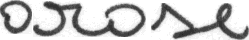

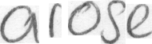

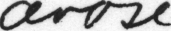

## Synthetischer Datensatz

Die Entscheidung, synthetische Daten hinzuzufügen, hatte zwei Ursachen:

**1. Klassenungleichgewicht im IAM-Datensatz**

Der IAM-Datensatz ist ungleich verteilt: Häufige Wörter wie „the" haben hunderte Beispiele, seltene Wörter dagegen nur 1–2. Die synthetischen Daten sollten diese Lücke schließen und seltene Wörter mit mehr Trainingsbeispielen absichern.

**2. Schlechte Erkennungsleistung bei eigenen Handschriften**

Der eigentliche Auslöser war das Testen des trainierten CRNN über die Web-Demo mit eigenen handgeschriebenen Bildern. Das Modell scheiterte dabei deutlich häufiger als auf dem IAM-Testdatensatz, obwohl die Test-CER akzeptabel war.

Der Grund liegt in der **eingeschränkten Stilvielfalt des IAM-Datensatzes**:

- IAM enthält Handschriften von 657 Schreiber:innen, überwiegend aus einem britisch-akademischen Kontext mit ähnlichem Schreibstil
- Das Modell lernte dadurch eine Vorstellung davon, wie Buchstaben aussehen
- Eigene Handschriften weichen in Buchstabenformen, Strichstärke, Neigung, Verbindungen zwischen Buchstaben und Schreibfluss stark davon ab
- Visuell ähnliche Zeichen (z. B. „a", „o", „e") wurden bei persönlichen Handschriften häufiger verwechselt als im Testdatensatz

Die synthetischen Daten sollten durch zusätzliche Schreibschrift-Stile die Robustheit des Modells gegenüber unbekannten Handschriften erhöhen.

### Generierung

Die Bilder wurden mit **TRDG (TextRecognitionDataGenerator)** erstellt, unter Verwendung von 8 Handschrift-Fonts:

- Caveat (Regular, Medium, SemiBold, Bold)
- Kalam (Light, Regular, Bold)
- Patrick Hand

Die Fonts wurden gezielt gewählt, da sie Schreibschrift imitieren und damit den IAM-Bildern ähneln. Zusätzlich sorgt eine zufällige Verzerrung (`distorsion_type=3`) für mehr Variation.

### Integration

- Die synthetischen Daten werden **nur dem Trainingsset** hinzugefügt. Val und Test bestehen ausschließlich aus echten IAM-Bildern, da die Modelle auf reale Handschrift bewertet werden sollen und nicht darauf, wie gut sie gerenderte Fonts erkennen
- Beim ersten Programmstart werden die Bilder generiert und auf Disk gespeichert (`data/synthetic/`)
- Bei jedem weiteren Start werden sie von Disk geladen, ohne neu generiert zu werden

### Auswirkung

Die synthetischen Daten hatten nur einen marginalen Effekt auf die Ergebnisse. Der Hauptgrund ist der **Domain Gap**: TRDG rendert Fonts, während IAM-Bilder echte Handschrift mit Tintenverlauf, Druck und natürlichem Zittern enthalten. Die Modelle lernen auf realem Datenmaterial besser als auf gerenderten Approximationen. Dennoch waren Verbesserungen der Erkennung von eigen verfassten Daten.

---

## Datenaufbereitung

Die Datei `words.txt` der IAM Handwriting Database enthält für jedes Wortbild einen Segmentierungsstatus.

Beispielzeile aus der Datei:

`c06-020-00-03 err 182 736 687 186 172 RB bloody`

Bedeutung der Spalten (vereinfacht):

- `c06-020-00-03`: Bild-ID des Wortes
- `err`: Segmentierungsstatus
- `182 736 687 186 172`: Positions- und Größenangaben der Bounding Box
- `RB`: Part-of-Speech-Tag
- `bloody`: Transkription des Wortes

Mögliche Werte:

- `ok`: korrekt segmentiertes Wort
- `err`: fehlerhafte Segmentierung (z. B. abgeschnittene oder verschobene Bounding Box)

Für dieses Projekt wurden ausschließlich Wortbilder mit dem Status `ok` verwendet.

Einträge mit `err` wurden ausgeschlossen, da sie:

- fehlerhafte Bild-Text-Zuordnungen enthalten können
- inkonsistente Segmentierungen aufweisen
- das Training destabilisieren könnten

## Methodik

Zur Untersuchung der Handschrifterkennung wurden zwei
unterschiedliche Modellierungsansätze implementiert
und systematisch miteinander verglichen:

- Wortbasierte Klassifikation (ResNet-18)
- Zeichenbasierte Sequenzmodellierung (CRNN)

Ziel ist es, die Unterschiede beider Ansätze
hinsichtlich Generalisierung, Skalierbarkeit und Fehlermuster
zu analysieren.

---

## Architektur (CRNN)

Die verwendete CRNN-Architektur orientiert sich an
Shi et al. (2016) und nutzt visuelle Feature-Extraktion
mit sequenzieller Kontextmodellierung.

### Architekturüberblick

- **Input Image:** 32 × 128 Pixel (Graustufen)
- **CNN Feature Extractor:** Extraktion visueller Merkmale
- **Feature Sequence:** Umwandlung der Feature-Maps entlang der Bildbreite in eine Sequenz
- **Bidirectional LSTM:** Kontextmodellierung über die gesamte Zeichenfolge
- **Linear Layer:** Projektion auf Zeichenwahrscheinlichkeiten
- **CTC Loss:** Optimierung ohne explizite Zeichen-Segmentierung

Das CNN extrahiert lokale visuelle Strukturen,
während das bidirektionale LSTM globale Abhängigkeiten
zwischen Zeichen modelliert.

Die Ausgabe ist eine Wahrscheinlichkeitsverteilung
über das definierte Alphabet für jeden Zeitschritt.

### Komponenten

- **CNN:** Extraktion hierarchischer Bildmerkmale
- **Bidirektionales LSTM:** Kontextintegration in beide Richtungen
- **CTC-Loss:** Alignment-freies Training
- **Greedy Decoding:** Umwandlung der Netzwerk-Outputs in Textsequenzen

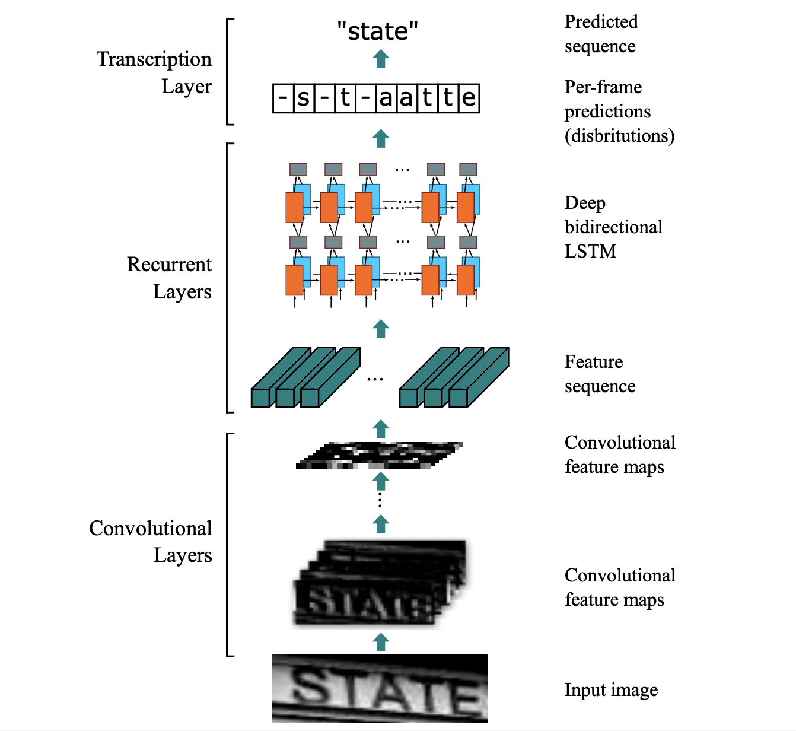

Der CTC-Mechanismus ermöglicht es dem Modell,
Zeichenfolgen direkt aus dem Gesamtbild zu lernen,
ohne dass eine explizite Segmentierung einzelner Zeichen
erforderlich ist.

---

## Architektur (ResNet-18)

Als Vergleichsmodell wurde eine ResNet-18-basierte
CNN-Architektur eingesetzt.

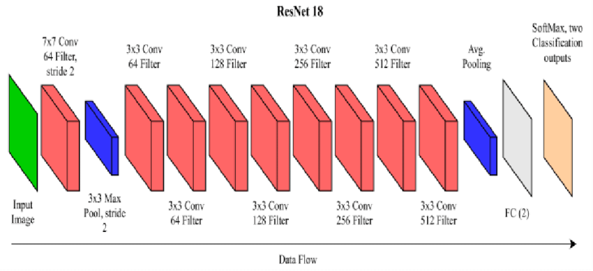

### Eigenschaften

- Residual-Verbindungen zur Stabilisierung tiefer Netzwerke
- CNN-basierte Feature-Extraktion
- Globale Pooling-Schicht
- Fully Connected Layer zur Klassifikation
- Optimierung mittels Cross-Entropy-Loss

Im Gegensatz zum CRNN behandelt das ResNet-18-Modell
jedes Wort als eigenständige Klasse.

Das Modell gibt eine Wahrscheinlichkeitsverteilung
über alle im Trainingsdatensatz vorhandenen Wörter aus.

---

## Training Setup

- Train/Val/Test Split: 80% / 10% / 10%
- Batch Size: 64
- Optimizer: Adam
- Initial Learning Rate: 1e-4
- Scheduler: ReduceLROnPlateau (factor=0.5, patience=2)
- Epochen: 40
- Early Stopping: patience=8 (basierend auf Validation CER bzw. Accuracy)
- Gradient Clipping: max_norm=5.0 (nur CRNN)
- Reproduzierbarkeit: Seed=42 (Python random, PyTorch)
- Evaluation: Character Error Rate (CER) & Accuracy

---

## Ergebnisse

### Final Test Performance

Die Modelle wurden auf dem unabhängigen Testdatensatz evaluiert.

**Ohne synthetische Daten:**

| Modell    | CER/Word Error | Word Accuracy |
| --------- | -------------- | ------------- |
| CRNN      | 7.86 %         | 78.79 %       |
| ResNet-18 | 22.48 %        | 77.52 %       |

**Mit synthetischen Daten (IAM + 50.000 synthetische Bilder):**

| Modell    | CER/Word Error | Word Accuracy |
| --------- | -------------- | ------------- |
| CRNN      | 7.55 %         | 79.82 %       |
| ResNet-18 | 20.95 %        | 79.05 %       |

---

## Trainingsverlauf

### CRNN – Training Loss

<p align="center">
  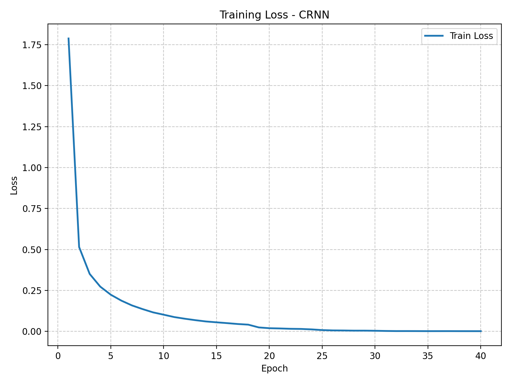<br>
  <em>Training Loss des CRNN über die Trainingspochen. Der Loss entspricht dem CTC-Loss zwischen der vorhergesagten Zeichenwahrscheinlichkeit und der Ground-Truth-Transkription.</em>
</p>

Der dargestellte Trainingsverlust entspricht dem **Connectionist Temporal Classification (CTC) Loss**, der die Differenz zwischen der vom Modell vorhergesagten Zeichenwahrscheinlichkeitssequenz und der tatsächlichen Zielsequenz misst.

Der CTC-Loss bewertet dabei alle möglichen Alignments zwischen Bild und Zeichenfolge und ermöglicht Training ohne explizite Zeichen-Segmentierung.

Ein niedrigerer Loss bedeutet, dass die vorhergesagte Zeichenverteilung besser mit der Ground-Truth-Transkription übereinstimmt.

Beobachtungen:

- Hoher Anfangsverlust durch zufällige Initialisierung der Netzwerkgewichte
- Der Loss sinkt über die Epochen
- Konvergenz nach ca. 20–25 Epochen

Interpretation:

Das Modell lernt visuelle Merkmale und übersetzt sie in Zeichenfolgen.

---

### CRNN – Validation CER

<p align="center">
  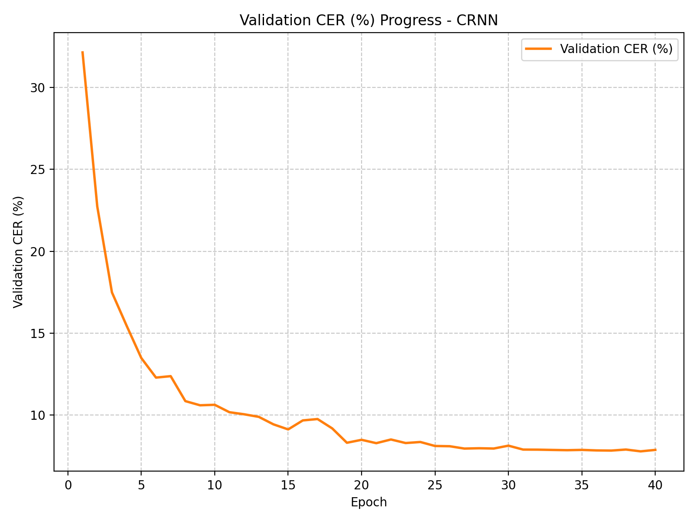<br>
  <em>Character Error Rate (CER) auf dem Validierungsdatensatz. Die CER misst den normalisierten Levenshtein-Abstand zwischen der vorhergesagten Zeichenfolge und der Ground-Truth-Transkription.</em>
</p>

Die **Character Error Rate (CER)** misst den Zeichenfehler zwischen Vorhersage und Ground Truth.

Sie wird definiert als:

CER = (Substitutionen + Insertionen + Deletionen) / Anzahl Ground-Truth-Zeichen

Beispiel:

Ground Truth: `house`  
Prediction: `hause`

→ 1 Substitution  
→ CER = 1 / 5 = 20 %

Die CER basiert auf der **Levenshtein-Distanz**, die den minimalen Editieraufwand zwischen zwei Zeichenketten bestimmt.

Beobachtungen:

- Schneller Abfall zeigt frühes Lernen von Zeichenstrukturen
- Stabilisierung auf niedrigem Niveau zeigt Generalisierung
- Geringe Differenz zwischen Training und Validation deutet auf geringe Überanpassung hin

Interpretation:

Das CRNN lernt eine Abbildung zwischen Bildsequenzen und Zeichenfolgen und überträgt sie auf unbekannte Daten.

---

### ResNet-18 – Training Loss

<p align="center">
  <br>
  <em>Training Loss des ResNet-18. Der Loss entspricht der Cross-Entropy zwischen der vorhergesagten Wortklasse und der tatsächlichen Wortklasse.</em>
</p>

Der Trainingsverlust basiert auf der **Cross-Entropy-Loss-Funktion**, die die Differenz zwischen der vorhergesagten Klassenwahrscheinlichkeit und der tatsächlichen Wortklasse misst.

Im Gegensatz zum CRNN erfolgt hier keine Zeichenmodellierung, sondern eine direkte Klassifikation des gesamten Wortbildes.

Ein Loss nahe 0 bedeutet, dass das Modell die Trainingswörter klassifiziert.

Beobachtungen:

- Schneller Abfall zeigt Anpassung an die Trainingsdaten
- Niedriger Training Loss zeigt Modellkapazität

Interpretation:

Das Modell lernt die Trainingsdaten, was zu Überanpassung führen kann.

---

### ResNet-18 – Validation Error (1 − Accuracy)

<p align="center">
  <br>
  <em>Klassifikationsfehler auf dem Validierungsdatensatz. Der Fehler entspricht dem Anteil falsch klassifizierter Wortbilder.</em>
</p>

Diese Metrik zeigt den **Klassifikationsfehler auf Wortebene** und wird berechnet als:

Error = 1 − Accuracy

Dabei gilt:

Accuracy = Anzahl korrekt klassifizierter Wörter / Gesamtzahl Wörter

Beispiel:

100 Wörter  
80 korrekt erkannt

→ Accuracy = 80 %  
→ Error = 20 %

Im Gegensatz zum CRNN wird hier die vollständige Wortklasse bewertet, nicht einzelne Zeichen.

Beobachtungen:

- Schnelle Verbesserung in frühen Trainingsphasen
- Frühe Sättigung zeigt begrenzte Generalisierungsfähigkeit

Interpretation:

Das Modell lernt Trainingswörter gut, kann jedoch neue Wortbilder schlechter klassifizieren.

---

## Modellvergleich

<p align="center">
  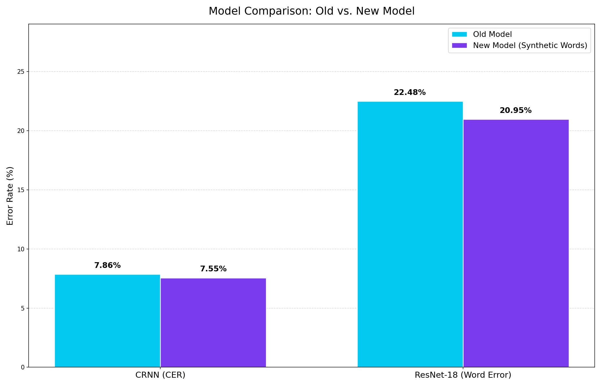<br>
  <em>Vergleich beider Modelle vor und nach Einführung der synthetischen Daten. Gezeigt werden Word Accuracy und Fehlerrate auf dem Testdatensatz.</em>
</p>

Der Vergleich zeigt die Ergebnisse beider Modelle vor und nach der Erweiterung des Trainingsdatensatzes um synthetische Daten.

Wichtiger Unterschied zwischen den Modellen:

CRNN:

- Fehler basiert auf Zeichenebene (Character Error Rate)
- Teilweise korrekte Vorhersagen werden berücksichtigt

ResNet-18:

- Fehler basiert auf Wortebene
- Vorhersage ist entweder vollständig korrekt oder falsch

Beispiel:

Ground Truth: `house`

Prediction CRNN: `houze`
→ nur ein Zeichen falsch

Prediction ResNet-18: `horse`
→ gesamtes Wort falsch

Interpretation:

CRNN modelliert Unterschiede auf Zeichenebene und erzielt bessere Gesamtleistung. Bei wachsendem Vokabular muss ResNet-18 immer mehr Wortklassen direkt trennen, was die Generalisierung erschwert. CRNN bleibt stabiler, weil es Zeichenfolgen modelliert und dadurch besser mit neuen Wortformen umgehen kann.

---

## Fehleranalyse

### Häufigste Zeichenverwechslungen

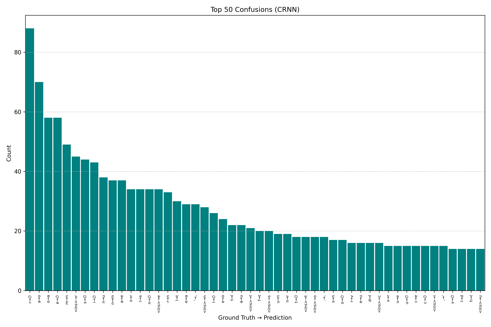

Die Balkengrafik zeigt die häufigsten Zeichenverwechslungen.

Beobachtungen:

- Verwechslungen treten vor allem bei visuell ähnlichen Zeichen auf
- Substitutionen sind häufiger als Insertions oder Deletions

---

### Confusion Heatmap

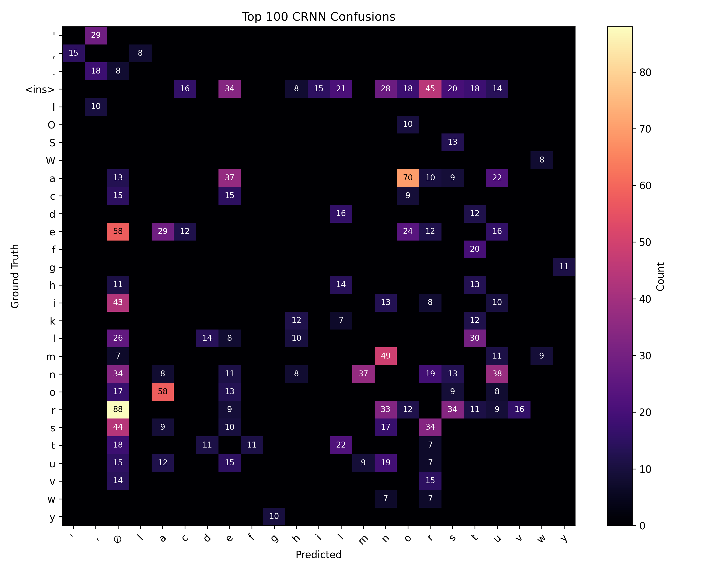

Die Heatmap visualisiert systematische Fehlerstrukturen.

Erkennbar sind:

- Cluster ähnlicher Kleinbuchstaben
- Häufige Verwechslung r <-> n, a <-> o
- Deletions bei schmalen Zeichen

Interpretation:

Fehler entstehen durch visuelle Ähnlichkeit,
nicht durch zufällige Fehlklassifikation.

---

### Web-Demo: Eigene Bilder

Neben der Auswertung auf dem IAM-Testdatensatz wurden beide Modelle mit
eigenen handgeschriebenen Bildern über die Web-Demo getestet.
Diese Tests waren der Auslöser für die Entscheidung, synthetische
Daten in das Training einzubeziehen (siehe [Synthetischer Datensatz](#synthetischer-datensatz)).

**Ergebnis „hallo":**

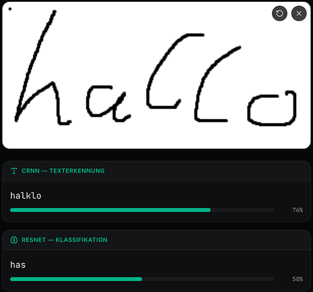

Das CRNN hat Schwierigkeiten, alle Buchstaben korrekt zu rekonstruieren.
Das Bild zeigt genau das Problem, das die synthetischen Daten beheben sollten:
Der individuelle Schreibstil weicht von den IAM-Handschriften ab, auf denen das
Modell trainiert wurde. Buchstabenformen, Strichführung und Verbindungen zwischen
Zeichen fallen anders aus als die Schriften der 657 IAM-Schreiber:innen, sodass
das Modell diese Variation nicht ausgleichen kann.

**Ergebnis „orange":**

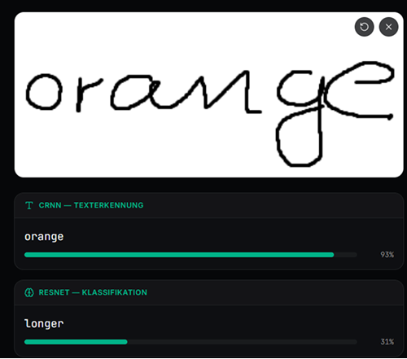

Das CRNN erkennt das Wort korrekt. Hier liegen die Buchstabenformen näher an
den IAM-Trainingsdaten, was eine zuverlässige Erkennung ermöglicht und zeigt,
dass das Modell grundsätzlich funktioniert, aber stark von der Ähnlichkeit
des Schreibstils zum Trainingsmaterial abhängt.

**ResNet-18 bei eigenen Bildern:**

Das ResNet-18-Modell schlägt bei eigenen Eingaben grundsätzlich fehl, sofern
das geschriebene Wort nicht Teil des Trainingsvokabulars ist. Da das Modell
jedes Wort als feste Klasse behandelt, kann es keine Wörter außerhalb dieser
Menge ausgeben. Dieses Verhalten bestätigt die im Modellvergleich diskutierte
Einschränkung der reinen Klassifikation.

**Auswirkung der synthetischen Daten:**

Die synthetischen Daten haben die Erkennungsleistung bei eigenen Handschriften
nur marginal verbessert. Der Grund: TRDG rendert Fonts mit gleichmäßiger
Strichstärke und ohne natürliche Variation. Echte Handschrift hingegen enthält
Tintenverlauf, Druckunterschiede, Zittern und individuelle Buchstabenformen,
die durch gerenderte Schriftarten nicht ausreichend simuliert werden können.
Ein wirkungsvoller Ansatz wäre die Erweiterung um echte Handschriftdaten
aus verschiedenen kulturellen und sprachlichen Kontexten.

Interpretation:

Die Web-Demo-Tests zeigen, dass eine gute Test-CER auf IAM nicht direkt auf
reale Handschriften übertragbar ist. Die Erkennungsqualität hängt stark davon
ab, wie ähnlich der individuelle Schreibstil den Trainingsdaten ist.

---

## Schlussfolgerung

Es werden zwei unterschiedliche Ansätze zur
Erkennung handgeschriebener Wörter verglichen:

- Wortbasierte Klassifikation (ResNet-18)
- Zeichenbasierte Sequenzmodellierung (CRNN)

### Beobachtungen

1. Das ResNet-18-Modell lernt Trainingsdaten schnell und erreicht
   perfekten Training Loss.

2. Die Validation-Performance des ResNet-18 stagniert jedoch früh,
   was auf Überanpassung hinweist.

3. Das CRNN-Modell zeigt einen stabilen Trainingsverlauf
   und reduziert die Character Error Rate.

4. Die Generalisierung auf Testdaten ist beim CRNN besser.

### Unterschiede der Ansätze

ResNet-18 behandelt jedes Wort als eigene Klasse.
Dies führt zu:

- Skalierungsproblemen bei großem Wortschatz
- Keine Generalisierung auf unbekannte Wörter
- Starke Abhängigkeit von Klassenverteilung

CRNN modelliert hingegen Zeichenfolgen.
Dies ermöglicht:

- Flexible Wortlängen
- Generalisierung auf neue Wortkombinationen
- Lernen ohne explizite Zeichen-Segmentierung (CTC)

### Gesamtbewertung

Die Ergebnisse zeigen, dass eine sequenzbasierte Modellierung
für Handschrifterkennung geeigneter ist als reine Wortklassifikation.

Während CNN-basierte Klassifikation für geschlossene Wortmengen
funktionieren kann, ist sie für realistische OCR-Szenarien
weniger geeignet.

Das CRNN-Modell bietet:

- Bessere Generalisierung
- Umgang mit variablen Wortlängen
- Niedrigere Fehlerraten
- Strukturkonformes Lernen

## Setup und Ausführung

### Installation

### Voraussetzungen

- Python 3.10+
- pip

---

### Virtuelle Umgebung erstellen

```bash
python -m venv venv
venv\Scripts\activate
```

### Abhängigkeiten installieren

```bash
pip install -r requirements.txt
```

### Hinweis zu CUDA (GPU-Unterstützung)

Standardmäßig installiert die `requirements.txt` die systemunabhängige Version von **PyTorch**.  
Diese funktioniert sowohl auf CPU-Systemen als auch auf Rechnern mit vorhandener CUDA-Installation.

Falls eine **NVIDIA-GPU mit CUDA 12.1** verwendet wird, muss in der `requirements.txt` der CUDA-spezifische Abschnitt aktiviert werden:

### 1. Standard-Version auskommentieren

```txt
# torch==2.5.1
# torchvision==0.20.1
# torchaudio==2.5.1
```

### 2. CUDA-Abschnitt einkommentieren

```txt
torch==2.5.1+cu121
torchvision==0.20.1+cu121
torchaudio==2.5.1+cu121
```

### 3. Alternative Installation über den offiziellen CUDA-Index

Alternativ kann PyTorch direkt mit CUDA-Unterstützung installiert werden:

```bash
pip install torch torchvision torchaudio --index-url https://download.pytorch.org/whl/cu121
```

### Wichtig

- Die CUDA-Version ist systemabhängig und setzt passende NVIDIA-Treiber voraus.
- Für Portabilität wird die Standard-Version empfohlen.
- Das Projekt funktioniert auf **CPU**; eine **GPU beschleunigt das Training**.

### Datensatz vorbereiten

1.  IAM Handwriting Database herunterladen\
    http://www.fki.inf.unibe.ch/databases/iam-handwriting-database

2.  Folgende Dateien entpacken:

- words.tgz
- ascii.tgz

3.  Inhalte in den Ordner `data/` verschieben

### Projektstruktur

```
machinelles-sehen-projekt/
|
|-- code/                 # Hauptcode
|   |-- data_code/        # Parsing, Dataset, Label-Encoding, Synthetisches Dataset
|   |-- encoder/          # CRNN- und ResNet-18-Architekturen
|   |-- training/         # Trainingslogik (train_crnn.py, train_resnet.py)
|   |-- main.py           # End-to-End Pipeline
|   |-- metrics.py        # CER, Word Accuracy, Levenshtein, Greedy Decoding
|   |-- evaluation.py     # Confusion-Analyse & Final Report
|   |-- plotting.py       # Trainingsplots
|   |-- run_training.bat  # Auto-Restart Trainingsstart (Windows)
|   `-- run_training.sh   # Auto-Restart Trainingsstart (macOS/Linux)
|-- data/
|   |-- words/            # IAM Wortbilder
|   |-- ascii/            # IAM Labels (words.txt)
|   `-- synthetic/        # Generierte synthetische Bilder + labels.txt
|-- fonts/
|   `-- handwriting/      # TTF Handschrift-Fonts für TRDG
|-- graphs/               # erzeugte Trainingsplots
|-- images/               # README Bilder
|-- pth/                  # gespeicherte Modelle (Checkpoints)
|-- web_demo/             # Interaktive Web-Demo
|   |-- backend/          # FastAPI-Backend (server.py, requirements.txt)
|   |-- app/              # Next.js Seiten
|   |-- components/       # React-Komponenten
|   `-- package.json      # Frontend-Abhängigkeiten
|-- requirements.txt
`-- README.md
```

### Projektstart

Das Training wird über ein Startskript im Ordner `code` gestartet.

Windows (PowerShell):

```bash
cd code
.\run_training.bat
```

macOS:

```bash
cd code
chmod +x run_training.sh
./run_training.sh
```

### Checkpoint-System

Während des Trainings werden automatisch Checkpoints im Ordner `pth/` gespeichert:

- `crnn_last.pth`: letzter Trainingsstand
- `crnn_best.pth`: bestes Modell basierend auf der Validation

### Automatisches Resume-Training

Falls das System abstürzt, führt `run_training.bat` das Program einfach erneut aus.

Das Training wird dann automatisch vom letzten gespeicherten Checkpoint fortgesetzt.

Es ist **kein erneutes manuelles Eingreifen oder Löschen der Modelle erforderlich**.

### Bereits abgeschlossenes Training

Falls die maximale Anzahl an Epochen bereits erreicht wurde, werden:

- die gespeicherten Trainingsmetriken geladen
- die Trainingsplots erneut generiert

ohne das Modell erneut zu trainieren.

Dieses Vorgehen stellt sicher:

- Checkpoints werden lokal gespeichert und Resume ist möglich
- Training ist notwendig
- System ist gegen Abstürze abgesichert
- Kein Datenverlust
- Reproduzierbarkeit ist gegeben

### Pipeline :

- Laden des IAM-Datensatzes (80/10/10 Split)
- Synthetische Daten laden (von Disk) oder generieren (TRDG)
- Training des CRNN-Modells (IAM + Synthetisch)
- Training des ResNet-18-Modells (IAM + Synthetisch)
- Validierung nach jeder Epoche
- Test CER- und Accuracy-Berechnung
- Trainingskurven Speicherung
- Fehleranalyse (Confusion Matrix)
- Modellvergleich (Error und Accuracy)

---

### Web-Demo starten

Nach abgeschlossenem Training können beide Modelle über die Web-Demo
direkt im Browser getestet werden.

Die Demo setzt voraus, dass die trainierten Modelle (`crnn_best.pth` und
`ResNet-18_best.pth`) im Ordner `pth/` vorhanden sind.

**1. Backend starten (FastAPI)**

```bash
cd web_demo/backend
pip install -r requirements.txt
python server.py
```

Das Backend lädt die gespeicherten Modelle und stellt sie über eine
REST-API bereit.

**2. Frontend starten (Next.js)**

```bash
cd web_demo
pnpm install
pnpm dev
```

Anschließend im Browser öffnen: `http://localhost:3000`

Die Oberfläche zeigt das hochgeladene Bild und darunter die Vorhersagen
beider Modelle: zuerst das CRNN-Ergebnis, dann das ResNet-18-Ergebnis.

---

## Poster


---

## Related Work

- IAM Handwriting Database  
  http://www.fki.inf.unibe.ch/databases/iam-handwriting-database

- Marti & Bunke (2002): IAM Dataset Paper  
  _The IAM-database: an English sentence database for offline handwriting recognition_  
  https://link.springer.com/article/10.1007/s100320200071

- Graves et al. (2006): CTC Paper  
  _Connectionist Temporal Classification: Labelling Unsegmented Sequence Data with Recurrent Neural Networks_  
  https://www.cs.toronto.edu/~graves/icml_2006.pdf

- Shi et al. (2016): CRNN Paper  
  _An End-to-End Trainable Neural Network for Image-Based Sequence Recognition_  
  https://arxiv.org/abs/1507.05717

- PyTorch Dataset & DataLoader Dokumentation  
  https://pytorch.org/docs/stable/data.html

- PyTorch CTCLoss Dokumentation  
  https://pytorch.org/docs/stable/generated/torch.nn.CTCLoss.html

- Beispiel CRNN Implementierung  
  https://github.com/meijieru/crnn.pytorch

- Shi et al. (2016): CRNN Architektur  
  https://arxiv.org/abs/1507.05717

- Hochreiter & Schmidhuber (1997): LSTM  
  https://www.bioinf.jku.at/publications/older/2604.pdf

- Levenshtein Distance (CER Berechnung)  
  https://en.wikipedia.org/wiki/Levenshtein_distance

- PyTorch ReduceLROnPlateau Scheduler  
  https://pytorch.org/docs/stable/generated/torch.optim.lr_scheduler.ReduceLROnPlateau.html

- Weitere CRNN Implementierung (Vergleich)  
  https://github.com/GitYCC/crnn-pytorch

---

## Autor

Erik Lang

## Lizenz

Dieses Projekt wurde im Rahmen des Moduls "Maschinelles Sehen" erstellt und dient ausschließlich zu Lehr- und Forschungszwecken.
